<div align="center">

# PromptRoute-Mamba

### Reliability-Aware Infrared-Visible Fusion with Prompt-Guided Routing and State-Space Modeling

[](https://www.python.org/)
[](https://pytorch.org/)
[](https://github.com/state-spaces/mamba)
[](#)

Official implementation of **PromptRoute-Mamba**, a progressive cross-modal reliability reasoning network for infrared-visible image fusion.

[Overview](#overview) · [Datasets](#datasets) · [Training](#training) · [Testing](#testing) · [Key Results](#key-experimental-results) · [Figure Gallery](#figure-gallery) · [Citation](#citation)

</div>

## Overview

PromptRoute-Mamba decomposes each modality into base and detail representations, performs reliability-aware prompt routing in the base stream, and uses state-space modeling for efficient long-range cross-modal coordination. Training follows a stable two-stage strategy: representation learning first, fusion learning second.

<p align="center">
  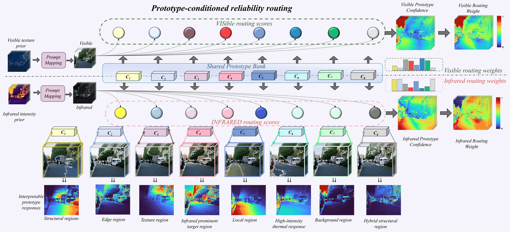
  <br><sub><b>Prompt-guided prototype routing.</b></sub>
</p>

### Highlights

- **Prompt-guided reliability routing** for position-wise modality selection.
- **Mamba-based global modeling** with a complementary high-frequency detail path.
- **Two-stage optimization** that preserves a stable, decodable representation space.

## Setup

The recommended environment is Python 3.8, PyTorch 2.4.1, CUDA 12.4, and `mamba-ssm` 2.2.2.

```bash
conda env create -f environment.yaml
conda activate prompt-route-mamba
```

Expected dataset layout:

```text
MSRS/
├── train/
│   ├── ir/
│   └── vi/
└── test/
    ├── ir/
    └── vi/
```

## Datasets

| Dataset | Usage in this work | Scale used | Official source |
|:--|:--|:--|:--|
| **MSRS** | Training, fusion evaluation, semantic segmentation | 1,083 train + 361 test pairs | [Linfeng-Tang/MSRS](https://github.com/Linfeng-Tang/MSRS) |
| **RoadScene** | Zero-shot fusion evaluation | 221 pairs | [hanna-xu/RoadScene](https://github.com/hanna-xu/RoadScene) |
| **TNO** | Zero-shot fusion evaluation | 261 pairs | [TNO Image Fusion Dataset](https://figshare.com/articles/dataset/TNO_Image_Fusion_Dataset/1008029) |
| **LLVIP** | Zero-shot low-light fusion evaluation | 3,463 test pairs | [bupt-ai-cz/LLVIP](https://github.com/bupt-ai-cz/LLVIP) |
| **M3FD** | Downstream object detection | 4,200 aligned pairs | [JinyuanLiu-CV/TarDAL](https://github.com/JinyuanLiu-CV/TarDAL) |

Please follow the license and citation requirements provided by each dataset owner. Dataset files are not redistributed in this repository.

## Training

### 1. Prepare aligned HDF5 patches

Set `IR_files` and `VIS_files` in `dataprocessing.py` to the MSRS training folders, then run:

```bash
python dataprocessing.py
```

### 2. Run two-stage training

Set the HDF5 path in `train.py` to the file generated above. Training parameters such as `num_epochs`, `epoch_gap`, and `batch_size` are defined at the top of the script.

```bash
python train.py
```

During epochs 1-4, the shared encoder and decoder learn base-detail decomposition and reconstruction. During epochs 5-12, they are frozen while the base and detail fusion modules are optimized. Checkpoints are saved under `models/`; TensorBoard events are written to `runs/`.

## Testing

Place paired test images under `test/ir` and `test/vi` with identical filenames. Set `ckpt_path` and `test_folder` in `test_IVF.py`, then run:

```bash
python test_IVF.py
```

The script saves fused PNG images under `test_result/MSRS` and reports EN, SD, SF, MI, SCD, VIF, Qabf, and SSIM.

## Key Experimental Results

<p align="center">
  
  <br><sub><b>Performance-complexity comparison on MSRS and RoadScene.</b></sub>
</p>

<p align="center">
  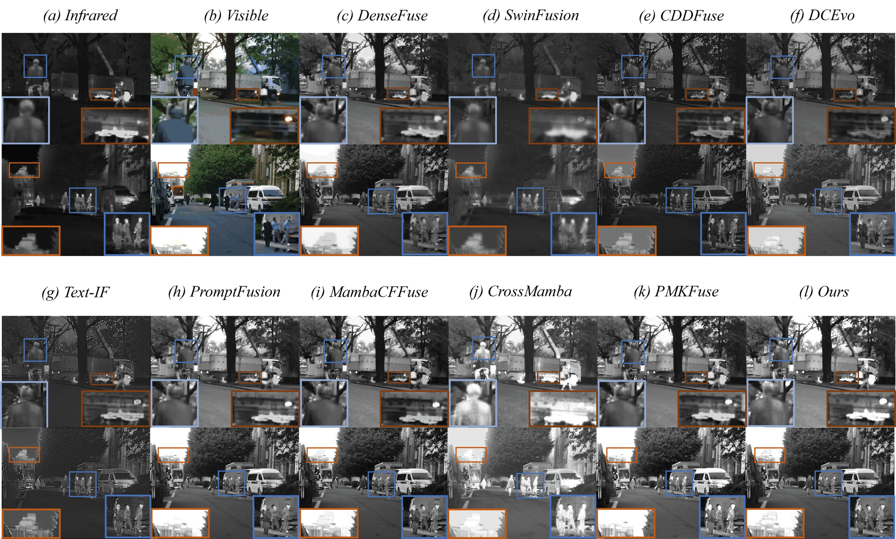
  <br><sub><b>Qualitative comparison on representative MSRS image pairs.</b></sub>
</p>

<p align="center">
  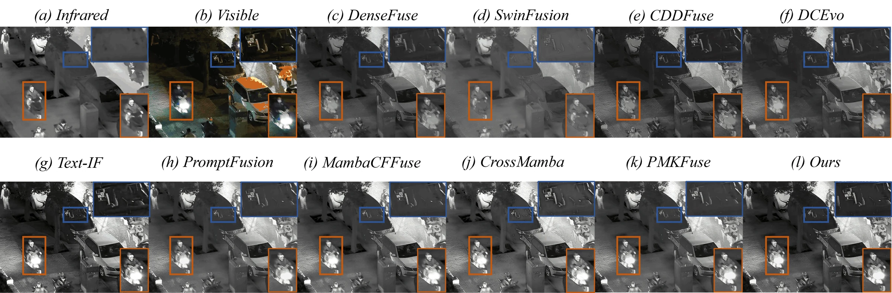
  <br><sub><b>Zero-shot qualitative comparison on the low-light LLVIP dataset.</b></sub>
</p>

<p align="center">
  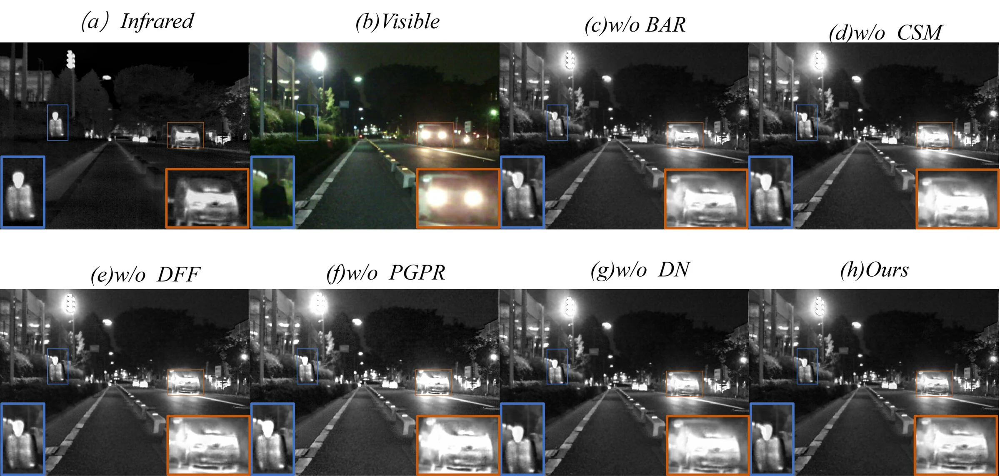
  <br><sub><b>Qualitative ablation analysis of the principal model components.</b></sub>
</p>

<p align="center">
  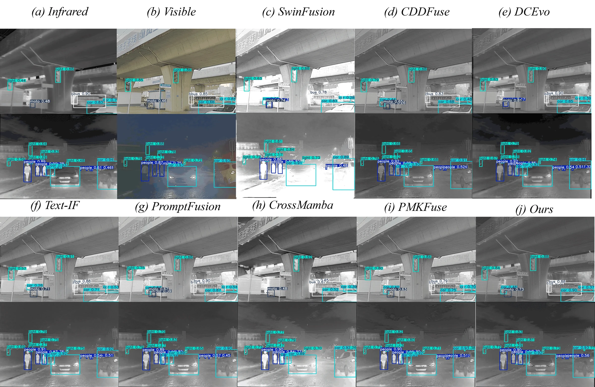
  <br><sub><b>Downstream object detection comparison on M3FD.</b></sub>
</p>

<p align="center">
  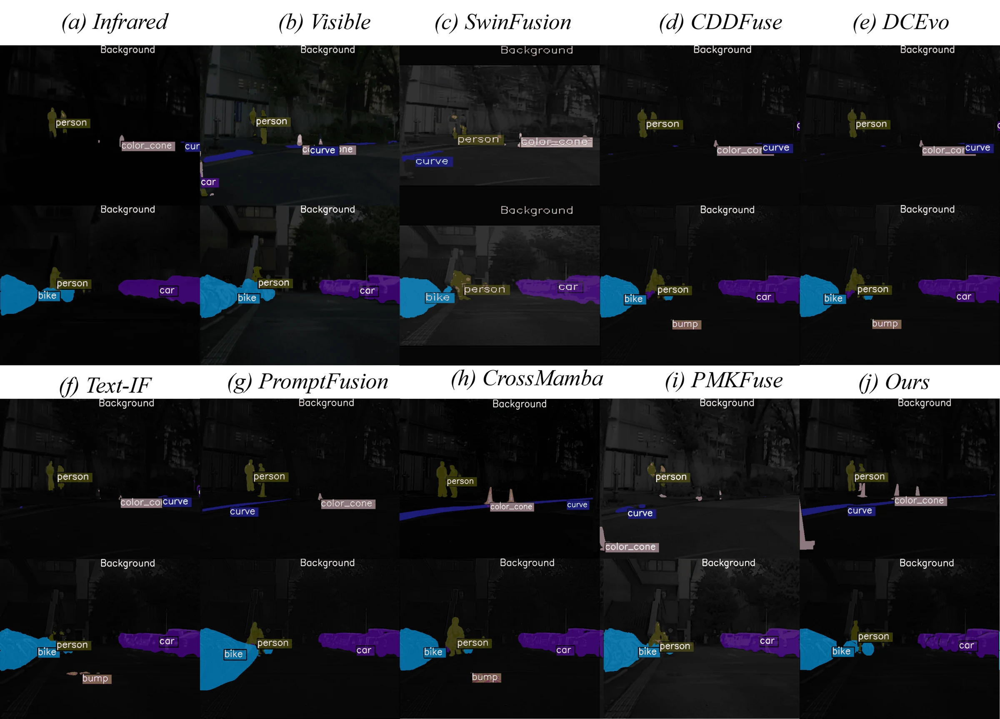
  <br><sub><b>Downstream semantic segmentation comparison on MSRS.</b></sub>
</p>

## Figure Gallery

The remaining paper figures are shown below in a full-width, single-column layout without repeating the figures above.

<p align="center">
  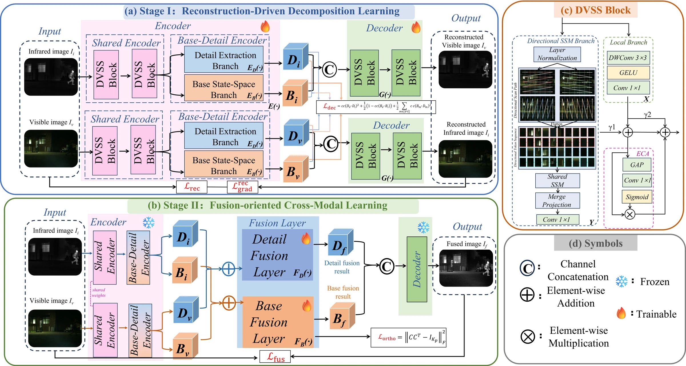
  <br><sub><b>Overall architecture of PromptRoute-Mamba.</b></sub>
</p>

<p align="center">
  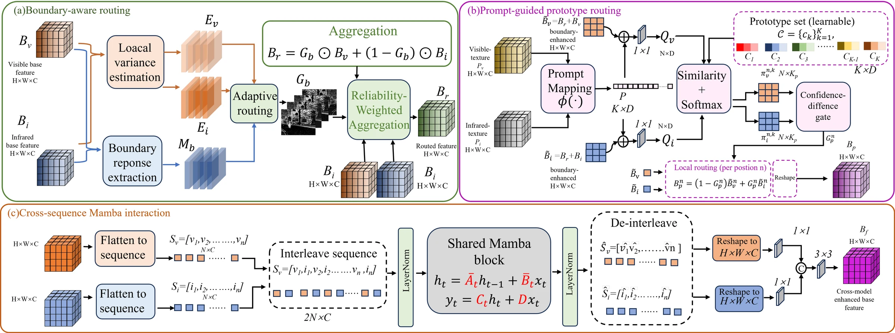
  <br><sub><b>Reliability-aware base fusion layer.</b></sub>
</p>

<p align="center">
  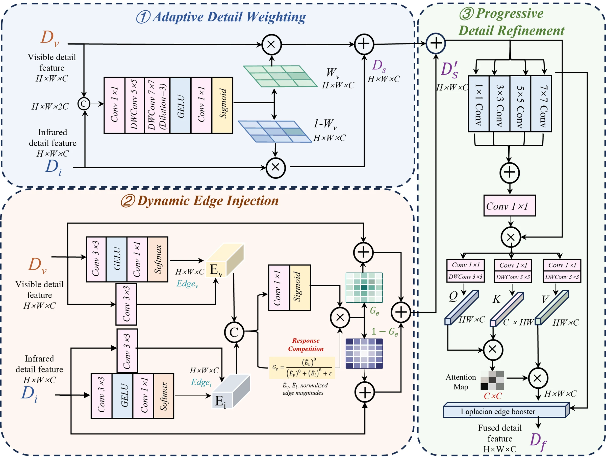
  <br><sub><b>Detail fusion layer.</b></sub>
</p>

<p align="center">
  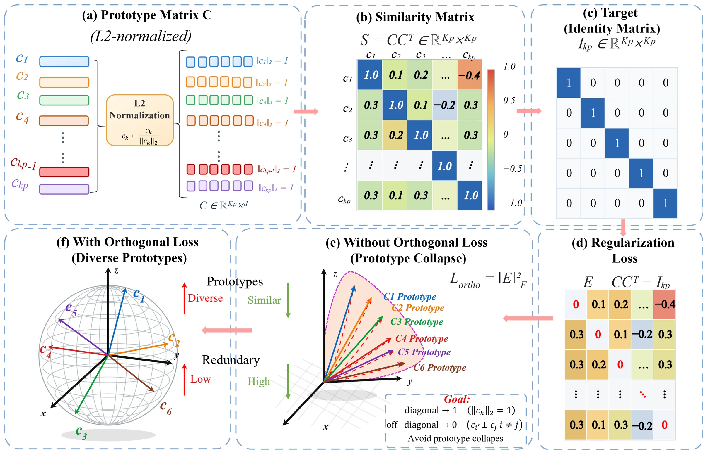
  <br><sub><b>Orthogonal prototype regularization.</b></sub>
</p>

<p align="center">
  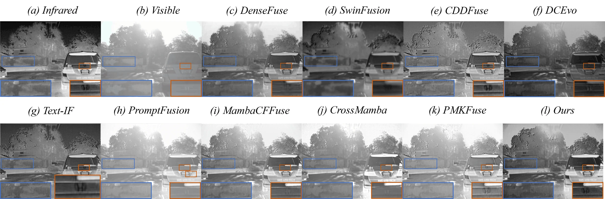
  <br><sub><b>RoadScene qualitative comparison.</b></sub>
</p>

<p align="center">
  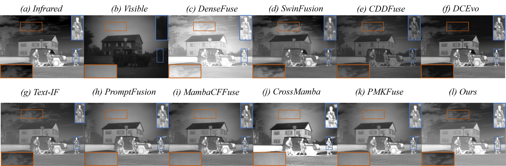
  <br><sub><b>TNO qualitative comparison.</b></sub>
</p>

<p align="center">
  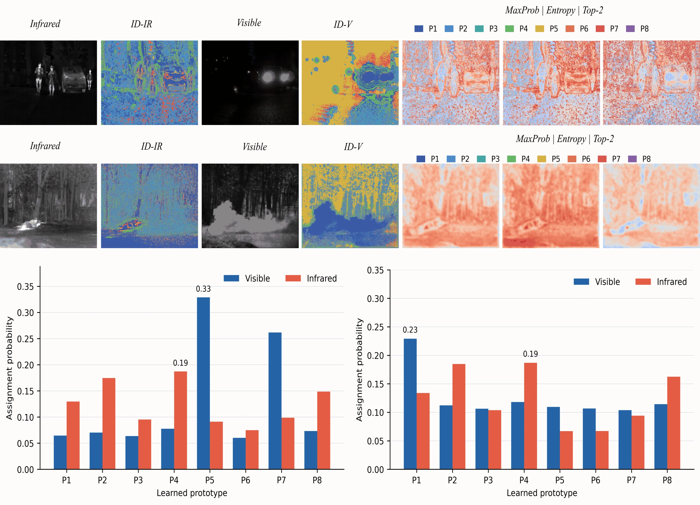
  <br><sub><b>Prototype-response analysis.</b></sub>
</p>

<p align="center">
  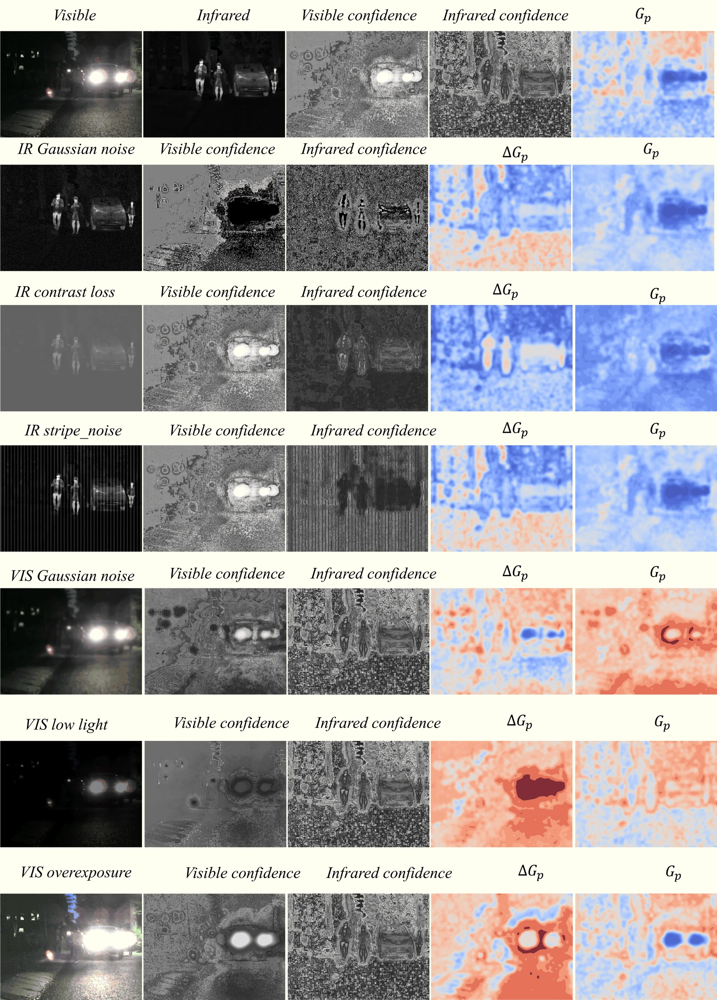
  <br><sub><b>Reliability under controlled corruptions.</b></sub>
</p>

<p align="center">
  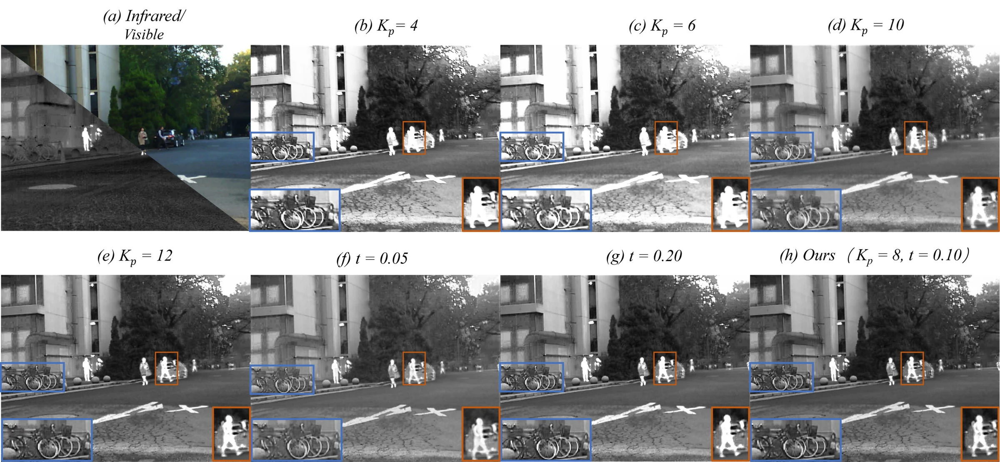
  <br><sub><b>Parameter sensitivity analysis.</b></sub>
</p>

<p align="center">
  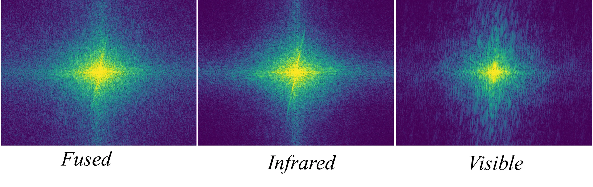
  <br><sub><b>Power spectral density analysis.</b></sub>
</p>

## Repository Layout

```text
PromptRoute-Mamba/
├── assets/figures/      # complete paper figure gallery
├── utils/               # data, losses, metrics, and image I/O
├── dataprocessing.py    # paired patch preparation
├── net.py               # PromptRoute-Mamba architecture
├── train.py             # two-stage optimization
├── test_IVF.py          # inference and evaluation
├── test_MIF.py          # medical-fusion evaluation inherited from CDDFuse
└── environment.yaml
```

Datasets, checkpoints, logs, TensorBoard runs, caches, and generated results are intentionally excluded from version control.

## Citation

```bibtex
@article{wang2026promptroutemamba,
  title   = {PromptRoute-Mamba: Reliability-Aware Infrared--Visible Measurement Fusion With Prompt-Guided Routing and State-Space Modeling},
  author  = {Wang, Dongming and Mou, Xingang and Wu, Sihan and Zhou, Xiao},
  year    = {2026}
}
```

## Acknowledgement

This implementation builds on ideas and utilities from [CDDFuse](https://github.com/Zhaozixiang1228/MMIF-CDDFuse) and the [Mamba](https://github.com/state-spaces/mamba) ecosystem.
