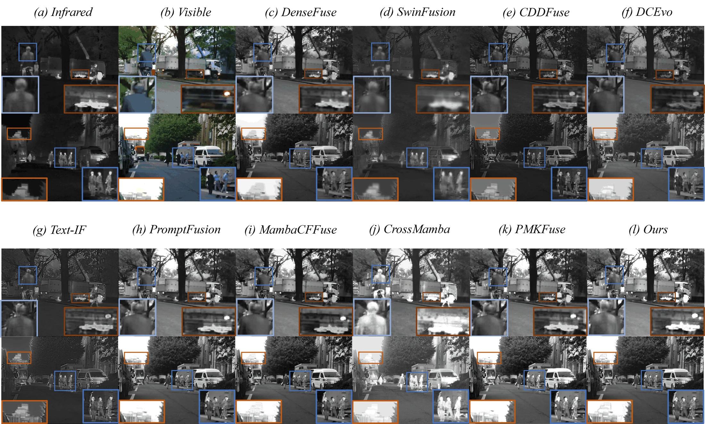
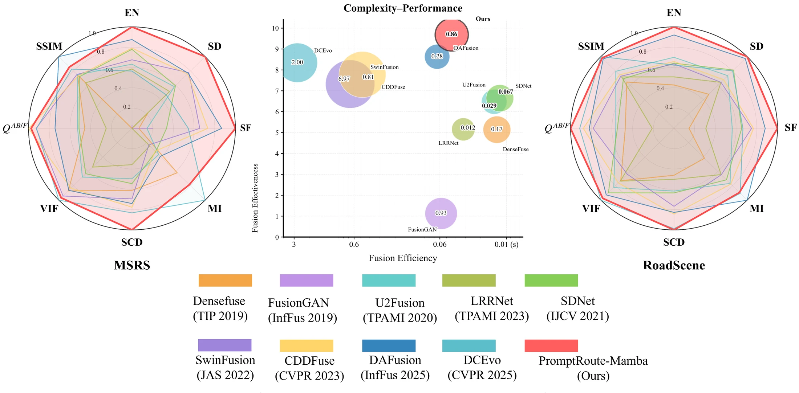

<div align="center">

# PromptRoute-Mamba

### Reliability-Aware Infrared-Visible Fusion with Prompt-Guided Routing and State-Space Modeling

[](https://www.python.org/)
[](https://pytorch.org/)
[](https://github.com/state-spaces/mamba)
[](#)

Official implementation of **PromptRoute-Mamba**, a progressive cross-modal reliability reasoning network for infrared-visible image fusion.

[Overview](#overview) · [Setup](#setup) · [Training](#training) · [Testing](#testing) · [Citation](#citation)

</div>

## Overview

PromptRoute-Mamba decomposes each modality into base and detail representations, performs reliability-aware prompt routing in the base stream, and uses state-space modeling for efficient long-range cross-modal coordination. Training follows a stable two-stage strategy: representation learning first, fusion learning second.

<p align="center">
  
</p>

### Highlights

- **Prompt-guided reliability routing** for position-wise modality selection.
- **Mamba-based global modeling** with a complementary high-frequency detail path.
- **Two-stage optimization** that preserves a stable, decodable representation space.

## Setup

The recommended environment is Python 3.8, PyTorch 2.4.1, CUDA 12.4, and `mamba-ssm` 2.2.2.

```bash
conda env create -f environment.yaml
conda activate prompt-route-mamba
```

Expected dataset layout:

```text
MSRS/
├── train/
│   ├── ir/
│   └── vi/
└── test/
    ├── ir/
    └── vi/
```

## Training

### 1. Prepare aligned HDF5 patches

```bash
python dataprocessing.py \
  --ir-dir /path/to/MSRS/train/ir \
  --vi-dir /path/to/MSRS/train/vi \
  --output data/MSRS_train_imgsize_256_stride_100.h5 \
  --patch-size 256 \
  --stride 100
```

### 2. Run two-stage training

```bash
python train.py \
  --data data/MSRS_train_imgsize_256_stride_100.h5 \
  --epochs 12 \
  --stage1-epochs 4 \
  --batch-size 2 \
  --device cuda
```

During epochs 1-4, the shared encoder and decoder learn base-detail decomposition and reconstruction. During epochs 5-12, they are frozen while the base and detail fusion modules are optimized. Checkpoints are saved under `models/`; TensorBoard events are written to `runs/`.

## Testing

Place paired test images under `test/ir` and `test/vi` with identical filenames, then run:

```bash
python test_IVF.py \
  --checkpoint models/PromptRoute-Mamba_XX-XX-XX-XX.pth \
  --input-dir /path/to/MSRS/test \
  --output-dir test_result/MSRS \
  --device cuda
```

The script saves fused PNG images and reports EN, SD, SF, MI, SCD, VIF, Qabf, and SSIM. Add `--no-metrics` when only fused images are needed.

## Results

<p align="center">
  
</p>

<p align="center">
  
</p>

PromptRoute-Mamba preserves thermal targets and structural detail while maintaining a favorable quality-efficiency balance.

## Repository Layout

```text
PromptRoute-Mamba/
├── assets/              # README figures
├── utils/               # data, losses, metrics, and image I/O
├── dataprocessing.py    # paired patch preparation
├── net.py               # PromptRoute-Mamba architecture
├── train.py             # two-stage optimization
├── test_IVF.py          # inference and evaluation
├── environment.yaml
└── requirements.txt
```

Datasets, checkpoints, logs, TensorBoard runs, caches, and generated results are intentionally excluded from version control.

## Citation

```bibtex
@article{wang2026promptroutemamba,
  title   = {PromptRoute-Mamba: Reliability-Aware Infrared--Visible Measurement Fusion With Prompt-Guided Routing and State-Space Modeling},
  author  = {Wang, Dongming and Mou, Xingang and Wu, Sihan and Zhou, Xiao},
  year    = {2026}
}
```

## Acknowledgement

This implementation builds on ideas and utilities from [CDDFuse](https://github.com/Zhaozixiang1228/MMIF-CDDFuse) and the [Mamba](https://github.com/state-spaces/mamba) ecosystem.
